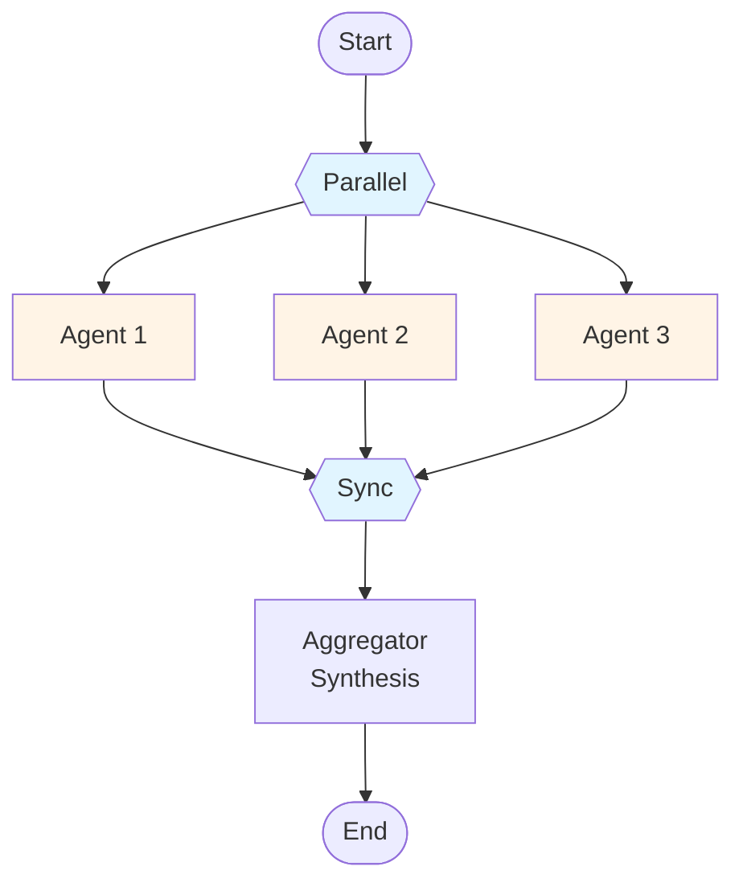
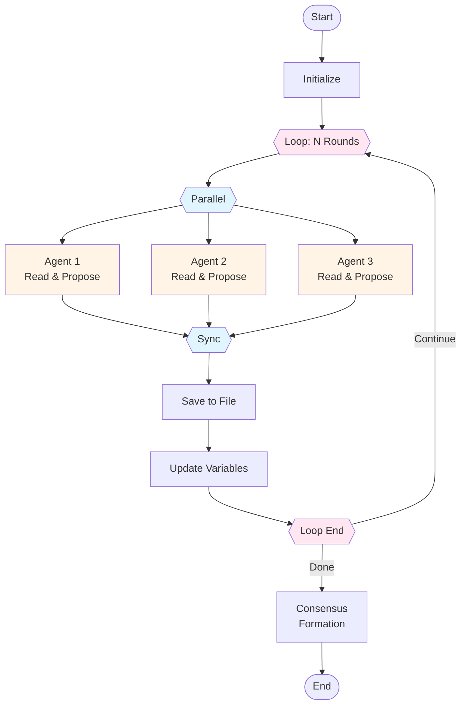
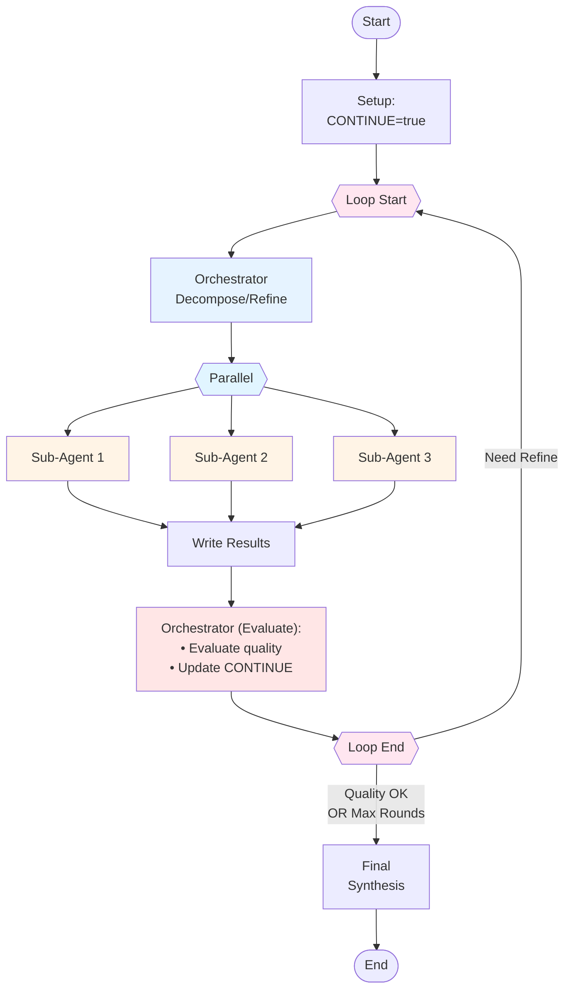
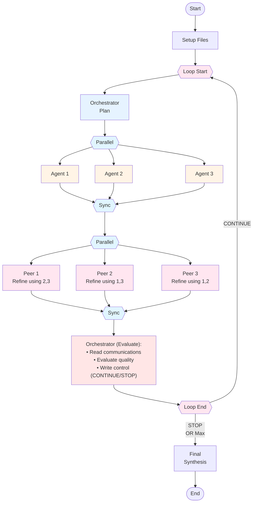

Ante supports multiple patterns for organizing agents to work together. Each architecture trades off between autonomy, coordination overhead, and result quality.

## Independent

Agents work in parallel on the same problem with no interaction. An aggregator synthesizes their outputs at the end.

**Best for:** tasks where diverse independent perspectives improve quality (brainstorming, redundant verification).

## Decentralized

Agents run in parallel rounds, reading each other's prior outputs and proposing refinements. After a fixed number of rounds, consensus is formed without a central coordinator.

**Best for:** debate-style reasoning, peer review, or negotiation where no single authority should dominate.

## Centralized Iterative

A central orchestrator decomposes the problem, dispatches sub-agents in parallel, evaluates their results, and decides whether to refine or finish.

**Best for:** complex tasks that benefit from top-down planning with quality gates (code generation with review, multi-step research).

## Hybrid Iterative

Combines centralized orchestration with decentralized peer refinement. The orchestrator plans and dispatches agents, then agents refine each other's work in a peer round before the orchestrator evaluates.

**Best for:** high-quality collaborative output where both structured planning and peer feedback matter (collaborative writing, architecture design).

## Choosing an architecture

| Architecture | Coordination | Iteration | Use when |
|---|---|---|---|
| **Independent** | None | Single pass | You need diverse perspectives without interaction overhead |
| **Decentralized** | Peer-to-peer | Fixed rounds | Agents should self-organize without a central authority |
| **Centralized Iterative** | Orchestrator-driven | Quality-gated | You need structured decomposition with evaluation checkpoints |
| **Hybrid Iterative** | Orchestrator + peers | Quality-gated | You want both top-down planning and bottom-up peer refinement |
