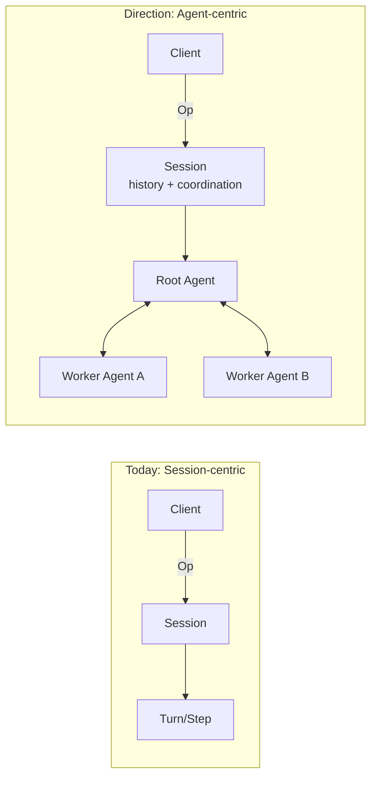

## Overview

Ante follows a clean separation of concerns with a client-daemon architecture. The UI and core logic are decoupled through message passing, making it possible to swap frontends (TUI, headless) without changing the underlying engine.


## Client-Daemon split

```
┌────────────────┐          ┌─────────────────────────────┐
│     Client      │    Op    │          Daemon              │
│                 │ ───────▶ │                              │
│  TUI (ratatui)  │          │  Session ─▶ Turn ─▶ Step    │
│  or Headless    │ ◀─────── │                              │
│                 │    Evt   │  Tools    Providers   Store  │
└────────────────┘          └─────────────────────────────┘
```

- **Client** — The user-facing layer. Either the ratatui-based TUI or the headless CLI runner. Sends `Op` operations and renders `Evt` events.
- **Daemon** — The core engine. Receives operations, manages sessions, dispatches to LLM providers, schedules tool execution, and emits events.
- **Transport** — Bounded async channels (Tokio) connect client and daemon within the same process. Message IDs enable tracing across the boundary.

## Architecture direction: Session-centric to Agent-centric

Ante started with a session-centric runtime where `Session` is the primary execution owner. We are moving toward an agent-centric runtime, where long-lived `Agent` instances own execution and communicate through messages.



This is similar to an actor-based model:

- **Agent as actor** — Each agent has isolated state, a mailbox, and a single logical execution loop.
- **Message-driven coordination** — Agents coordinate via typed messages/events instead of shared mutable state.
- **Hierarchical supervision** — Parent agents can spawn child agents (sub-agents), monitor outcomes, and decide retry/escalation policy.

Why this shift:

- Better isolation between concurrent tasks and sub-agents
- Clear ownership of memory, permissions, and tool budgets per agent
- More predictable scaling as workflows become multi-agent

In this direction, `Session` remains important, but as a container for user interaction history, persistence, and protocol-level coordination rather than the only unit of execution.


## LLM providers

Ante is provider-agnostic. Each provider implements a common interface for sending prompts and receiving streaming responses.

| Provider | Wire Format | Models |
|---|---|---|
| Anthropic | Messages API | Claude family |
| OpenAI | Chat Completions / Responses | GPT-4o, o1, etc. |
| Gemini | Gemini API | Gemini family |
| Grok | OpenAI-compatible | Grok models |
| Open Router | OpenAI-compatible | Multiple providers |
| Local | llama.cpp | GGUF models |

Providers are resolved from a catalog at session init time. The user can override via CLI flags (`--provider`, `--model`) or persistent settings.

### Authentication

- **API keys** — Set via environment variables (`ANTHROPIC_API_KEY`, `OPENAI_API_KEY`)
- **OAuth** — Interactive OAuth flow supported for Anthropic and OpenAI, handled through the TUI

## Tool system

Tools are the agent's hands. Each tool implements the `Tool` trait:

```rust
#[async_trait]
pub trait Tool: Send + Sync {
    fn metadata(&self) -> &ToolMetadata;
    async fn call(&self, input: ToolCallInput) -> Result<ToolCallOutput>;
}
```

### Built-in tools

| Tool | Category | Approval | Description |
|---|---|---|---|
| `Read` | File I/O | No | Read file contents |
| `Write` | File I/O | Yes | Create or overwrite files |
| `Edit` | File I/O | Yes | Exact string replacement in files |
| `Glob` | File I/O | No | Find files by pattern |
| `Grep` | File I/O | No | Search file contents with regex |
| `Bash` | Shell | Yes | Execute shell commands |
| `BashOutput` | Shell | No | Read output from background shells |
| `KillShell` | Shell | No | Terminate background shells |
| `Task` | Builtin | No | Spawn sub-agent for complex tasks |
| `TodoWrite` | Builtin | No | Manage task lists |
| `WebFetch` | Builtin | No | Fetch and process web content |
| `WebSearch` | Builtin | No | Search the web |

### Tool filtering

Tools can be filtered at session level:

- **Allowed list** (`--allowed-tools`) — Only these tools are available
- **Disallowed list** (`--disallowed-tools`) — These tools are removed
- Supports ToolMatcher syntax: `Bash(ls -la)`, `Task(explore)`
- Names are matched case-insensitively

## Session lifecycle

1. Client sends `Op::StartSession` with model, provider, and policy
2. Daemon resolves the provider, authenticates, discovers skills and sub-agents
3. Daemon creates a `Session` and emits `Evt::SessionStart`
4. User sends `Op::UserInput` to start a task
5. Session spawns a `Turn` which communicates with the LLM
6. Turn executes tools, requests approvals, and eventually completes
7. When the context budget nears the limit, auto-compaction summarizes the history

## Storage

Ante stores configuration and state across several locations:

| Location | Purpose |
|---|---|
| `~/.ante/settings.json` | User preferences (model, provider, theme) |
| `~/.ante/skills/` | User-level skills |
| `~/.ante/agents/` | User-level sub-agents |
| `.ante/` | Project-local configuration |
| `.ante/projects/` | Project memory directory |
| `/tmp/ante/` | Temporary files scoped per project |

The `ANTE_HOME` environment variable can override the home config directory.
