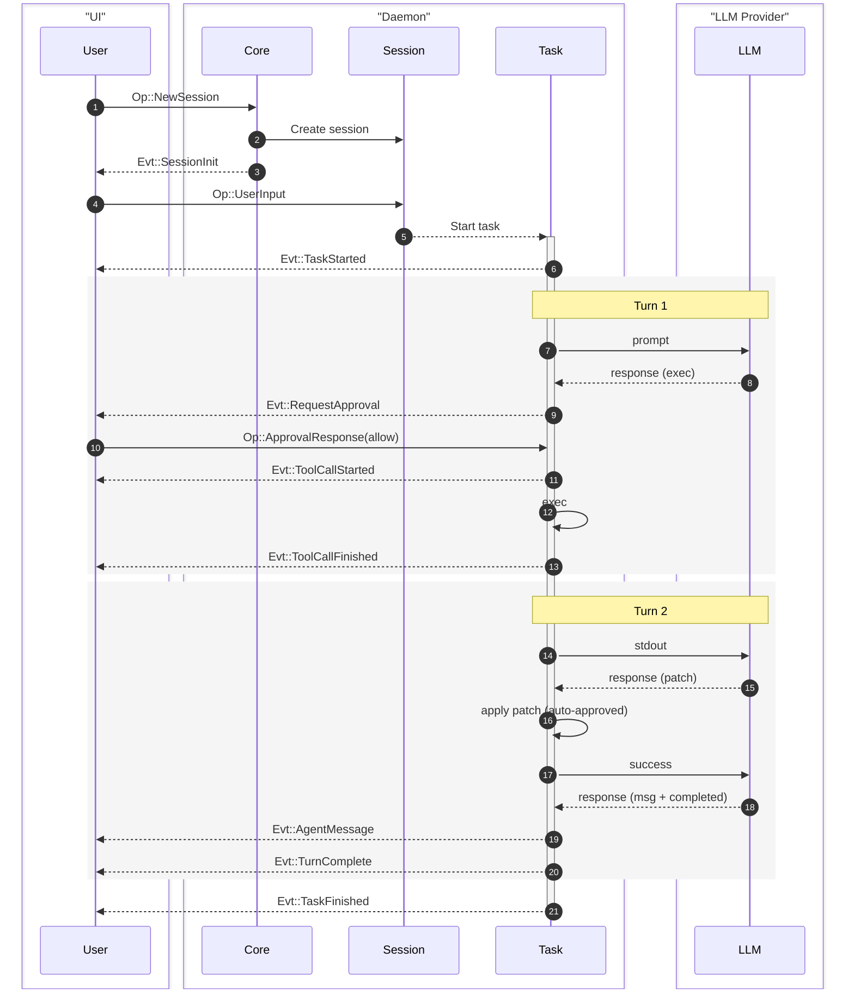
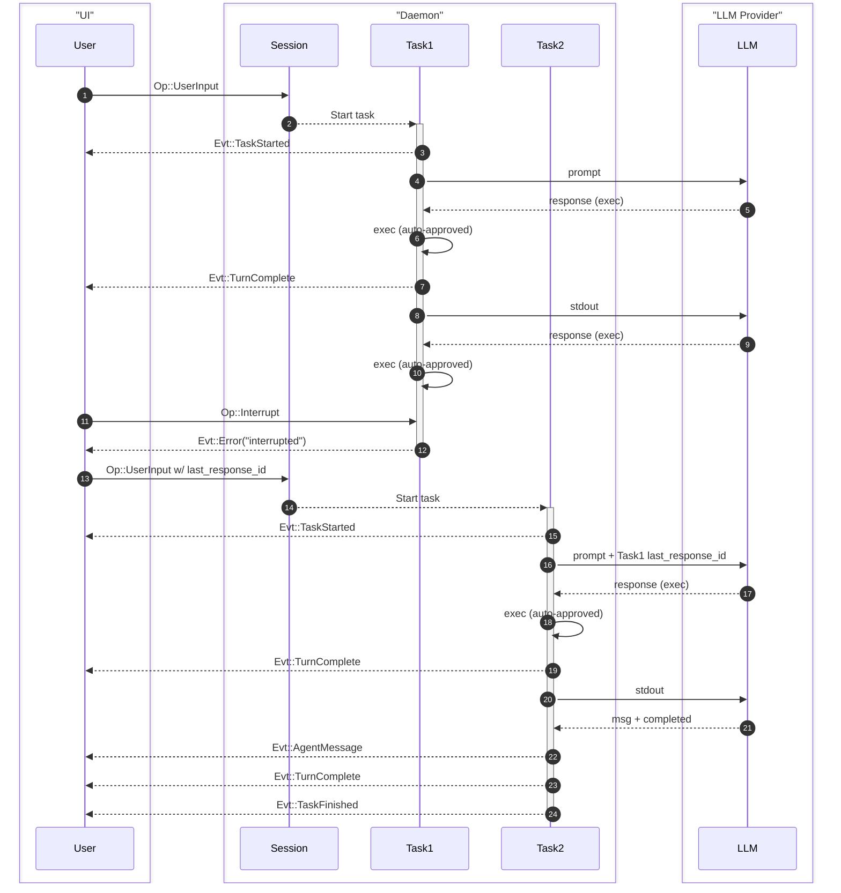

Ante models agent interactions as a hierarchy of concepts, connected by a typed message-passing protocol.

## Concept hierarchy

```
Project
 └── Session
      └── Task
           └── Turn
                └── Step
```

| Concept | Description |
|---|---|
| **Project** | A git repo or root directory. Can have multiple sessions. |
| **Session** | One episode of interaction between user and Ante. Manages dialog state, token usage, and context compaction. |
| **Task** | One piece of work the user wants to accomplish. Can span multiple turns. |
| **Turn** | One back-and-forth with the agent. Starts with user input, ends with agent message or approval request. |
| **Step** | One interaction from agent with LLM. Handles tool calls and other mechanics. |

<Note>
Generally, if there is no approval interruption, one task consists of one turn.
</Note>

## Protocol: Ops and Events

Ante uses a message-passing protocol between the client (TUI or headless runner) and the daemon. Operations (`Op`) flow from client to daemon, and events (`Evt`) flow from daemon to client.

### Message IDs

Every message has a custom `Id` type with a 4-byte prefix for tracing:

- `op_` — operations
- `evt_` — events
- `ses_` — sessions
- `step_` — steps

## Operations reference

| Op | Fields | Description |
|---|---|---|
| `NewSession` | model, provider, policy, streaming, config | Initialize a new session |
| `UserInput` | String | Submit a user prompt |
| `ApprovalResponse` | allow/deny | Respond to tool approval request |
| `SlashCommand` | skill name, args | Invoke a skill |
| `OfflineMode` | OfflineModeOp | Offline mode operations |
| `Interrupt` | — | Abort the current task |
| `Shutdown` | — | Clean shutdown |

## Events reference

| Evt | Fields | Description |
|---|---|---|
| `SessionInit` | metadata | Session is ready |
| `TaskStarted` | id | A new task has begun |
| `TaskFinished` | id, error, is_interrupted | Task completed or failed |
| `AgentMessage` | String | Text response from agent |
| `Thinking` | String | Chain-of-thought content |
| `MessageDelta` | String | Streaming content chunk |
| `ToolCallStarted` | tool_use | Tool execution began |
| `ToolCallFinished` | result | Tool execution completed |
| `ToolCallCancelled` | — | Tool execution was cancelled |
| `RequestApproval` | tool_use | Agent needs permission |
| `UsageUpdate` | tokens, cost | Token/cost tracking |
| `Info` | String | Informational message |
| `Error` | String | Error message |

## Flow examples

### Basic UI flow

A single user input followed by a 2-turn task:



### Task interruption

Interrupting a task and continuing with additional user input:



## Context management

Ante automatically manages context windows:

- **Token budget** — Each turn tracks token usage against the model's context limit
- **Auto-compaction** — When the dialog approaches the context limit, Ante uses the LLM to summarize the conversation history, preserving important context while freeing tokens
- **Tool result trimming** — Large tool outputs are automatically trimmed to fit within budget

## Permissions

Ante has a permission system that gates tool execution. Rules are evaluated in first-match-wins order, with three possible decisions: **Allow**, **Ask**, or **Deny**. See the [Permissions](/configuration/permission) page for full details.
