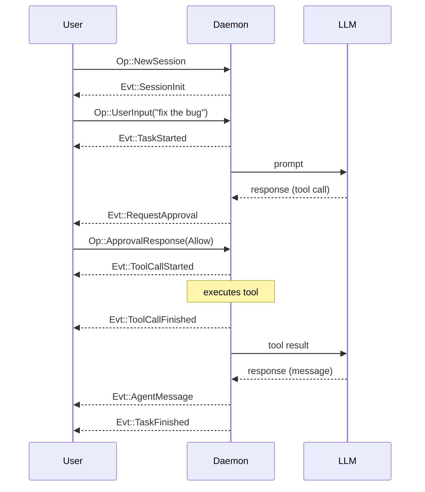

Ante models agent interactions as a hierarchy of concepts. Understanding these helps you reason about how the system works and how to extend it.

## Concept hierarchy

```
Project
 └── Session
      └── Task
           └── Turn
                └── Step
```

### Project

A **Project** corresponds to a git repository or root directory. A project can have multiple sessions.

### Session

A **Session** represents one episode of interaction between the user and Ante. When you launch Ante (TUI or headless), a session is created. The session manages the dialog state, tracks token usage, and handles context compaction when approaching limits.

### Task

A **Task** represents a single user intent — one piece of work the user wants to accomplish. A task can take arbitrarily long to finish and may require multiple turns (e.g., if tool approval is needed).

<Note>
Generally, if there is no approval interruption, one task consists of one turn.
</Note>

### Turn

A **Turn** is one back-and-forth with the agent. It starts with a user operation (like `UserInput`) and ends with either an agent message or a request for approval. A turn can involve multiple steps.

### Step

A **Step** is a single interaction from the agent with the LLM. Each step handles tool calls and potentially other mechanics like guardrails or hooks.

## Protocol: Ops and Events

Ante uses a message-passing protocol between the client (TUI or headless runner) and the daemon.

### Operations (Op)

Operations flow from the **client to the daemon**. Key operations:

| Op | Description |
|---|---|
| `NewSession` | Initialize a session with model, provider, and policy |
| `UserInput` | Submit a user prompt |
| `ApprovalResponse` | Respond to a tool approval request |
| `SlashCommand` | Execute a custom command |
| `Interrupt` | Abort the current task |
| `Shutdown` | Clean shutdown |

### Events (Evt)

Events flow from the **daemon to the client**. Key events:

| Evt | Description |
|---|---|
| `SessionInit` | Session is ready with metadata |
| `TaskStarted` / `TaskFinished` | Task lifecycle boundaries |
| `AgentMessage` | Text response from the agent |
| `Thinking` | Agent's chain-of-thought (if enabled) |
| `ToolCallStarted` / `ToolCallFinished` | Tool execution lifecycle |
| `RequestApproval` | Agent needs permission to execute a tool |
| `UsageUpdate` | Token and cost tracking |

### Message IDs

Every message has a custom `Id` type with a 4-byte prefix for tracing:

- `op_` — operations
- `evt_` — events
- `ses_` — sessions
- `step_` — steps

## Flow example

A typical interaction:



## Context management

Ante automatically manages context windows:

- **Token budget** — Each turn tracks token usage against the model's context limit
- **Auto-compaction** — When the dialog approaches the context limit, Ante uses the LLM to summarize the conversation history, preserving important context while freeing tokens
- **Tool result trimming** — Large tool outputs are automatically trimmed to fit within budget

## Permissions

Ante has a permission system that gates tool execution:

| Policy | Behavior |
|---|---|
| `Default` | Tools marked `requires_approval` prompt the user before execution |
| `Yolo` | All tools execute without approval |

In the TUI, you approve or deny each tool call interactively. In headless mode, `--yolo` is implied (all tools auto-approved).

Tools like `Bash` and `Write` require approval by default, while read-only tools like `Read`, `Glob`, and `Grep` do not.
