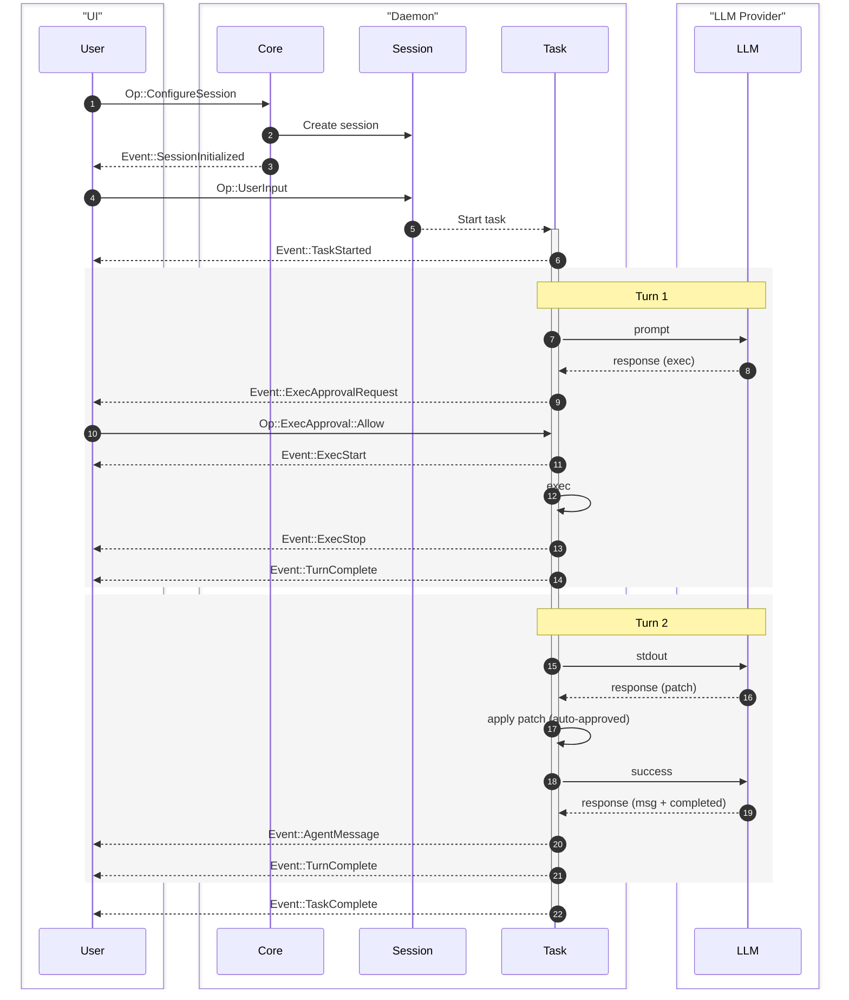
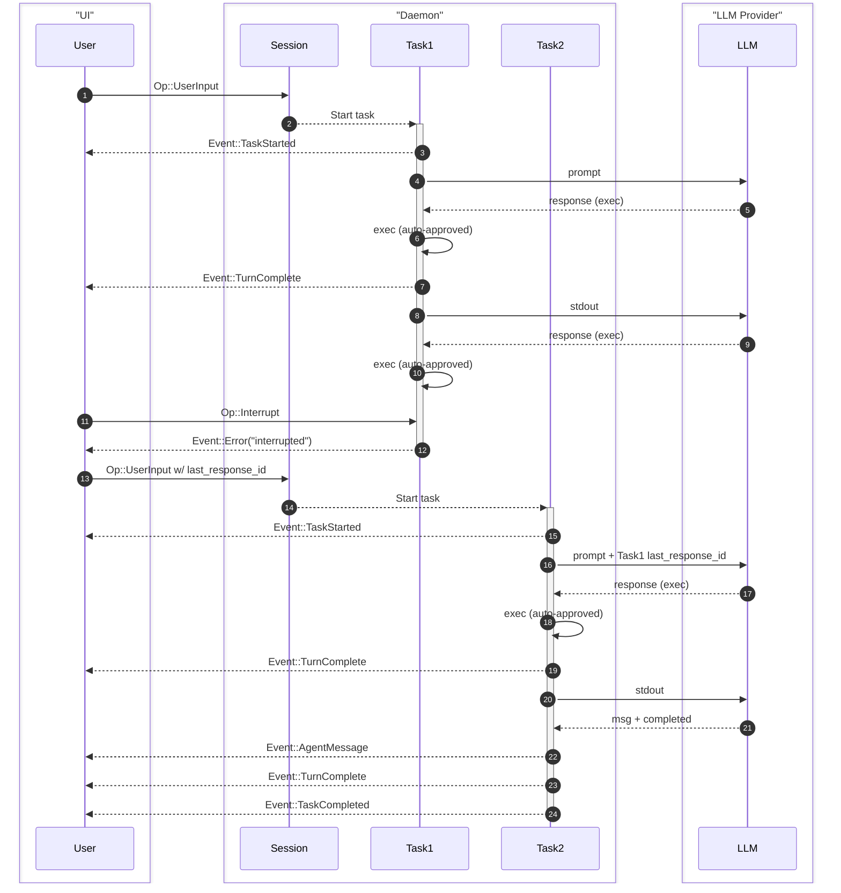

# Protocol Specification

Each Agent/Session is modeled similar to process with input queue and output queue.

## Core Concepts

`Project`
- corresponding to a git repo or a root directory
- can have multiple `Session`

`Session`
- respresent a episode of interaction between user and Ante
- where user send some Op to generate a `Task` to this session

`Task`
- Abstract concept of intent representing one piece of where user want to accomplish
- can take arbitrarily long to finish
- can be completed through multiple `Turn`

`Turn`
- one back and forth with agent
- start with user `Op`
- can end with agent message or request for approval
- can be completed with multiple `Step`

** Generally if there is not approval interruption, one Task is consist of one `Turn`

`Step`
- one interaction from Agent with LLM 
- handle tool calls and potentially other mechanics (guardrail, hooks, etc.)

`Op`
- Action that is initiated

`Evt`
- Events that can be from environment or effects of an `Op`

`Server`
- Sender of Evt and Receiver of Op

`Client`
- Sender of Op and Receiver of Evt

### Basic UI Flow

A single user input, followed by a 2-turn task

### Task Interrupt

Interrupting a task and continuing with additional user input.

