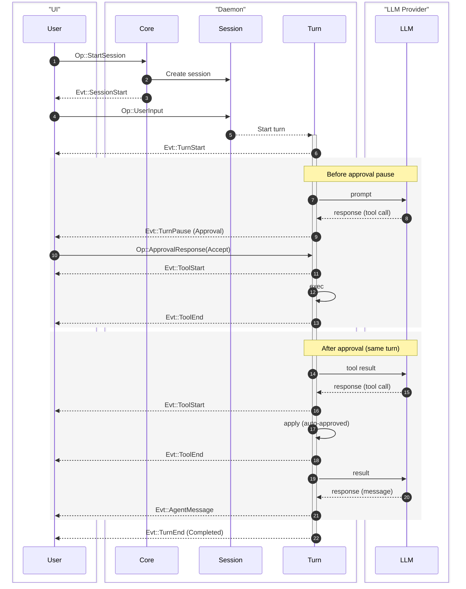
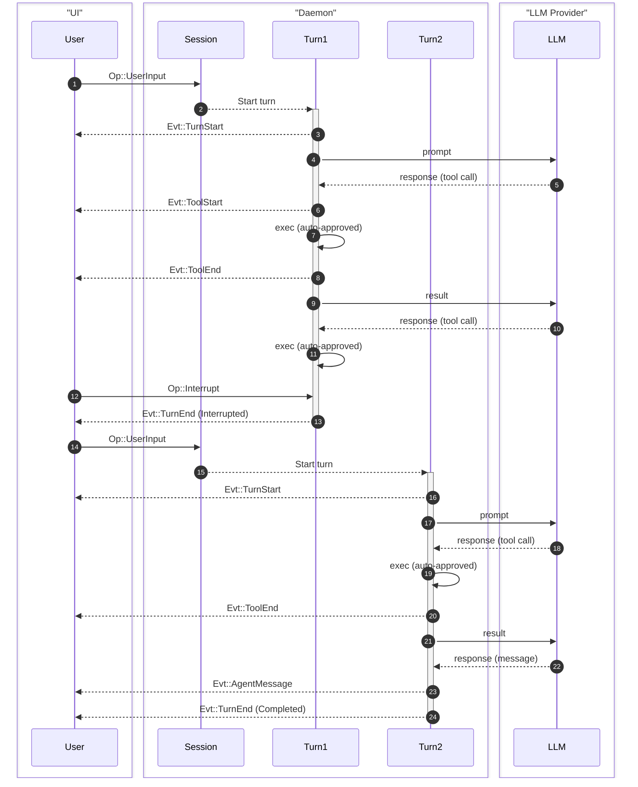

Ante models agent interactions as a hierarchy of concepts, connected by a typed message-passing protocol.

## Concept hierarchy

```
Project
 └── Session
      └── Task
           └── Turn
                └── Step
```

| Concept | Description |
|---|---|
| **Project** | A git repo or root directory. Can have multiple sessions. |
| **Session** | One episode of interaction between user and Ante. Manages dialog state, token usage, and context compaction. |
| **Task** | One piece of work the user wants to accomplish. Can span multiple turns. |
| **Turn** | One back-and-forth with the agent. Starts with user input, ends with agent message or approval request. |
| **Step** | One interaction from agent with LLM. Handles tool calls and other mechanics. |

:::note
Generally, if there is no approval interruption, one task consists of one turn.
:::

## Protocol: Ops and Events

Ante uses a message-passing protocol between the client (TUI or headless runner) and the daemon. Operations (`Op`) flow from client to daemon, and events (`Evt`) flow from daemon to client.

### Message IDs

Every message has a custom `Id` type with a 4-byte prefix for tracing:

- `op_` — operations
- `evt_` — events
- `ses_` — sessions
- `step_` — steps

## Operations reference

Operations (`Op`) are sent from the client to the daemon, wrapped in an `OpMsg` envelope with a unique `Id`.

| Op | Payload | Description |
|---|---|---|
| `StartSession` | `SessionConfig` | Initialize a new session with model, provider, policy, and options |
| `UpdateSession` | `SessionUpdate` | Update the active session (e.g. switch models) without restarting |
| `UserInput` | `String` | Submit a user prompt |
| `Steer` | `String` | Additional user guidance for the active turn |
| `ApprovalResponse` | `turn_id`, `responses: [(tool_id, ReviewDecision)]` | Respond to tool approval requests |
| `SlashCommand` | `name`, `args` | Invoke a skill by name |
| `OfflineMode` | `OfflineModeOp` | Offline mode operations (init, install, load model, etc.) |
| `Interrupt` | — | Abort the current running operation |
| `Shutdown` | — | Graceful shutdown |

## Events reference

Events (`Evt`) are sent from the daemon to the client, wrapped in an `EventMsg` envelope with a timestamp, unique `Id`, and optional `parent` ID linking back to the originating operation.

| Evt | Payload | Description |
|---|---|---|
| `SessionStart` | `SessionInitialized` | Session initialized with model, provider, session ID, working directory |
| `SessionUpdated` | `SessionInitialized` | Session updated in place (e.g. model changed) |
| `SessionEnd` | — | Session terminated |
| `TurnStart` | `turn_id` | A new turn has begun |
| `TurnPause` | `turn_id`, `reason` | Turn paused (e.g. waiting for tool approval) |
| `TurnEnd` | `turn_id`, `status` | Turn completed, interrupted, or errored |
| `AgentMessage` | `String` | Complete text response from agent |
| `Thinking` | `String` | Complete chain-of-thought block |
| `MessageDelta` | `String` | Streaming message content chunk |
| `ThinkingDelta` | `String` | Streaming thinking content chunk |
| `ToolStart` | `ToolUse` | Tool execution began |
| `ToolUpdate` | `tool_use_id`, `seq`, `message` | Tool execution progress update |
| `ToolEnd` | `tool_use_id`, `status`, `result_json`, `is_error` | Tool execution completed |
| `UsageUpdate` | `usage` | Token usage statistics |
| `CompactStart` | — | Dialog compaction started |
| `CompactEnd` | — | Dialog compaction completed |
| `ExtensionRefreshed` | `skills`, `subagents` | Skills and subagents refreshed |
| `OfflineMode` | `OfflineModeEvt` | Offline mode events (init status, progress, ready, etc.) |
| `Info` | `String` | Informational message |
| `Error` | `String` | Error message |
| `Goodbye` | — | Final message before disconnect |

:::note
For the full protocol reference with wire format examples and all type definitions, see the [Protocol Reference](/concepts/protocol) page.
:::

## Flow examples

### Basic UI flow

A single user input where one turn pauses for approval (`TurnPause`) and then resumes:



### Interruption flow

Interrupting a running turn and continuing with new input:



## Context management

Ante automatically manages context windows:

- **Token budget** — Each turn tracks token usage against the model's context limit
- **Auto-compaction** — When the dialog approaches the context limit, Ante uses the LLM to summarize the conversation history, preserving important context while freeing tokens
- **Tool result trimming** — Large tool outputs are automatically trimmed to fit within budget

## Permissions

Ante has a permission system that gates tool execution. Rules are evaluated in first-match-wins order, with three possible decisions: **Allow**, **Ask**, or **Deny**. See the [Permissions](/configuration/permission) page for full details.
